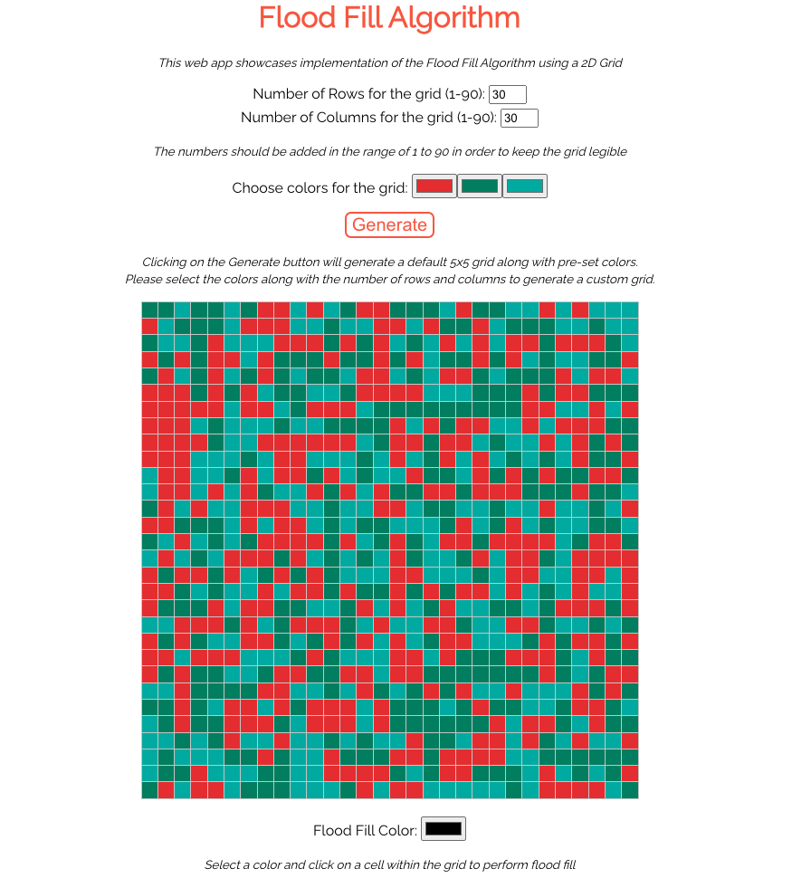

# Flood Fill Algorithm Challenge
This web application is designed to implement the Flood Fill Algorithm challenge given by OHRI.

The following functionality has been built:
- Separate front-end and back-end.
- Front-end focuses on the UI of the web app and back-end implements the Flood Fill Algorithm.
- Two input elements that allow the user to change the number of rows and columns of the grid.
- Three inputs that allow the user to select 3 colors, which are then randomly assigned to the cells of the grid.
- A color picker input with which the user selects the color they want to flood fill with.
- User can click on a cell in the grid and the algorithm is executed.

### Technologies used

- Front end: React
- API: RESTful
- Backend: Node/Express

Here is a screenshot of the application:



Let's look at how to get the code running.
### Requirements

- A clone of this [repository](https://github.com/MandeepKundal/ohri-flood-fill-algo-challenge.git) is needed. This requires `git` to be installed.
- [Node version = 14.17.6](https://nodejs.org/en/download) must be installed.
- [npm version = 7.23.0](https://docs.npmjs.com/downloading-and-installing-node-js-and-npm) must be installed.

### Starting the web application
https://github.com/MandeepKundal/ohri-flood-fill-algo-challenge.git
The [repository](https://github.com/MandeepKundal/ohri-flood-fill-algo-challenge.git) is available on GitHub. To clone it open a terminal to a directory of your
choosing and run the following command:

```bash
git clone https://github.com/MandeepKundal/ohri-flood-fill-algo-challenge.git
```

Now we'll have the code in the directory `ohri-flood-fill-algo-challenge` directly under our current directory. Next we change the directory to that.

```bash
cd ohri-flood-fill-algo-challenge
```

Next we install the required node dependencies for the server

```bash
npm install
```

Once all the dependencies have been installed, we will start the server 

```bash
npm start
```

Now we open a new terminal window and go to our current directory and then change directory to `client` to get React spun up

```bash
cd client
```

and then to install node dependencies

```bash
npm install
```

Once all the dependencies have been installed, we will start the server 

```bash
npm start
```

Our servers should be running on port `3000` and `5000` and the assignment is ready to be tested. Just open a browser and navigate to `http://localhost:3000/`.